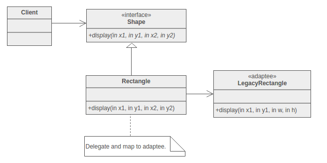
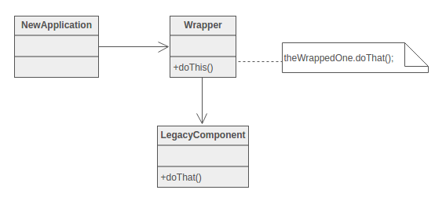

Adapter
=

Intent :
-
1. It matches an old component or structure of code to a new system of programming.
1. It covers an existing class by a new interface.
1. It converts the interface of a class to other interface that the new client expects and it also lets them work together .

Problem :
----
 It is used to reuse an old architecture of code. Sometimes the view of the world may not be adaptable with the internal architecture of the code .

Discussion :
----
Interface of programming or coding style or requirements are changed .But a old formation or code or algorithms are 
needed to be used .
	Let me discuss about a old structure, a two pinned plug to charge any electrical device .Now a days we have our charger of three pins. If there is a situation of havinng no three pin plug but there are two pin plug everywhere .There is a solution that we can use an adapter of three to two pin. This can handle the incident. Here adapter is working like a device that makes a new perspective to adapt with an old phenomenon.
	In programming Adapter is about creating an intermediate abstraction that translates or maps the old component to the new component. Clients call the Adapter objects methods and these methods redirects them to call the methods of the old class. This pattern can be implemented with inheritance.
	Let us have a class legacy_rectangle where the Olddraw() method needs parameter as the upper left co-ordinate and lower right co-ordinate. If an new client needs to draw the rectangle by using the upper left co-ordinate and the hight and widht. Here a pproblem occurs .To solve this problem we need to use the method Olddraw() without creating any object of the legacy_rectangle. 
	Here we can create a class adapter which inherits legacy_rectangle and by the methods and construcor of this class we can map the methods and constructor of the legacy_rectangle class. We can use a generic class rectangle which is inherited by the adapter class .

Structure :
----
Here the adapter class will get the parameter of the upper left co-ordinate and the hight and weidth. Then the programme 
will execute teh method Olddraw() .

->New application-
	->requires a interface to use doThat() method by different relevant parameters.
->Wrapper class-
	->This class makes the mapping of the required method of LegacyComponent.
->LegacyComponent-
	->LegacyComponent is the raw class containing the rae method doThat()

Rules of thumb :
----
->Adapter makes things work after they're designed; Bridge makes them work before they are.
->Bridge is designed up-front to let the abstraction and the implementation vary independently. Adapter is retrofitted
to make unrelated classes work together.
->Adapter provides a different interface to its subject. Proxy provides the same interface. Decorator provides an
enhanced interface.

A sample code in C++ programming language :
----
/*
      This programme is collected form sourcemaking.com website.
      I found this code very easy to understand the adapter pattern
    */
    #include<bits/stdc++.h>
    using namespace std ; 

    typedef int Coordinate;
    typedef int Dimension;

    // Desired interface that the client needs
    class Rectangle{
      public:
        virtual void draw() = 0; //desired draw method
    };

    // Legacy component or the old raw component
    class LegacyRectangle{
      public:
        LegacyRectangle(Coordinate x1, Coordinate y1, Coordinate x2, Coordinate y2){
            x1_ = x1;
            y1_ = y1;
            x2_ = x2;
            y2_ = y2;
            cout << "LegacyRectangle:  create.  (" << x1_ << "," << y1_ << ") => ("<< x2_ << "," << y2_ << ")" << endl;
        }
        void oldDraw(){ // The legacy draw method
            cout << "LegacyRectangle:  oldDraw.  (" << x1_ << "," << y1_ << ") => (" << x2_ << "," << y2_ << ")" << endl;
        }
      private:
        Coordinate x1_;
        Coordinate y1_;
        Coordinate x2_;
        Coordinate y2_;
    };

    // Adapter wrapper 
    class RectangleAdapter: public Rectangle, private LegacyRectangle{
      public:
        RectangleAdapter(Coordinate x, Coordinate y, Dimension w, Dimension h):LegacyRectangle(x, y, x + w, y + h){
            cout << "RectangleAdapter: create.  (" << x << "," << y <<"), width = " << w << ", height = " << h << endl;
        }
        virtual void draw(){
            cout << "RectangleAdapter: draw." << endl;
            oldDraw();
        }
    };

    int main(){
      Rectangle *r = new RectangleAdapter(120, 200, 60, 40); // 
      r->draw();
    }

    /*
    OUTPUT
    ______

    LegacyRectangle:  create.  (120,200) => (180,240)
    RectangleAdapter: create.  (120,200), width = 60, height = 40
    RectangleAdapter: draw.
    LegacyRectangle:  oldDraw.  (120,200) => (180,240)

    */
